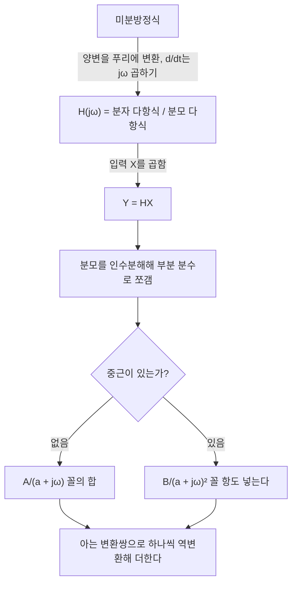



요약

미분방정식으로 적힌 LTI 시스템은 양변을 푸리에 변환하면 미분이 $$j\omega$$ 곱셈으로 바뀌어 대수식이 된다. 그러면 주파수 응답은 $$j\omega$$에 대한 다항식 두 개의 비(유리함수)로 바로 읽힌다. 출력을 구할 때는 $$Y = HX$$를 부분 분수로 쪼개 이미 아는 변환쌍($$\frac{1}{a + j\omega}$$, $$\frac{1}{(a+j\omega)^2}$$)으로 하나씩 되돌리면 된다. 단, 시스템이 안정해서 주파수 응답이 존재한다고 가정한다.

## 예시로 보기

$$\frac{dy}{dt} + ay = x$$, $$a > 0$$(예제 4.24)[^1].

- 양변을 변환: $$j\omega Y + aY = X$$.
- $$H(j\omega) = \frac YX = \frac{1}{j\omega + a}$$.
- 예제 4.1의 쌍과 비교하면 임펄스 응답은 $$h(t) = e^{-at}u(t)$$. 2장에서 미분방정식을 풀어 구한 것과 같다.

## 정의

$$\sum_{k=0}^{N}a_k\frac{d^ky}{dt^k} = \sum_{k=0}^{M}b_k\frac{d^kx}{dt^k}$$인 LTI 시스템의 주파수 응답을 구하는 두 길[^2]:

1. 복소 지수가 고유함수라는 사실로: $$x = e^{j\omega t}$$이면 $$y = H(j\omega)e^{j\omega t}$$이고, 이것을 식에 넣어 $$H$$를 푼다(3.10절 RC 필터에서 쓴 방법).
2. 변환의 미분 성질로: 양변을 변환하고 선형성과 $$\frac{d^kx}{dt^k} \leftrightarrow (j\omega)^kX$$를 쓰면 $$Y\sum a_k(j\omega)^k = X\sum b_k(j\omega)^k$$.

정리

$$H(j\omega) = \frac{Y(j\omega)}{X(j\omega)} = \frac{\sum_{k=0}^{M}b_k(j\omega)^k}{\sum_{k=0}^{N}a_k(j\omega)^k}$$

$$j\omega$$에 대한 다항식 두 개의 비(유리함수)다[^2].

**부분 분수 전개**[^3]. 유리함수를 $$\frac{A}{x - p}$$ 꼴의 합으로 쪼갠다.

- 서로 다른 근: $$\frac{1}{(x-2)(x-1)} = \frac{A}{x-2} + \frac{B}{x-1}$$. $$A = \lim_{x\to2}(x-2)\cdot\frac{1}{(x-2)(x-1)} = 1$$, $$B = -1$$.
- 제곱근(중근)이 있으면 $$\frac{A}{x+p} + \frac{B}{x+q} + \frac{C}{(x+q)^2}$$ 꼴로 둔다. 예: $$\frac{1}{x^2(x+4)} = \frac Ax + \frac{B}{x^2} + \frac{C}{x+4}$$에서 $$C = \frac{1}{x^2}\big\vert _{x=-4} = \frac{1}{16}$$, $$B = \frac{1}{x+4}\big\vert _{x=0} = \frac14$$, $$A = \frac{d}{dx}\frac{1}{x+4}\big\vert _{x=0} = -\frac{1}{16}$$.
- 계수 비교로 풀어도 된다.

미분방정식이 대수식으로 바뀐 뒤에는 부분 분수와 아는 변환쌍만 쓴다. 중근이 있으면 쪼갤 때 제곱 항을 따로 둔다.[^s3]

## 예제

**예제 4.25** $$\frac{d^2y}{dt^2} + 4\frac{dy}{dt} + 3y = \frac{dx}{dt} + 2x$$[^4]

1. *주파수 응답:* $$H = \dfrac{j\omega + 2}{(j\omega)^2 + 4j\omega + 3} = \dfrac{j\omega + 2}{(j\omega + 1)(j\omega + 3)}$$.
2. *부분 분수:* $$= \dfrac{1/2}{j\omega + 1} + \dfrac{1/2}{j\omega + 3}$$.
3. *역변환:* $$h(t) = \frac12e^{-t}u(t) + \frac12e^{-3t}u(t)$$.

**예제 4.26** 같은 시스템에 $$x(t) = e^{-t}u(t)$$[^5]

1. *곱:* $$Y = HX = \dfrac{j\omega + 2}{(j\omega + 1)^2(j\omega + 3)}$$.
2. *부분 분수:* $$\dfrac{A_{11}}{j\omega + 1} + \dfrac{A_{12}}{(j\omega + 1)^2} + \dfrac{A_{21}}{j\omega + 3}$$. 분자를 맞추면 $$A_{11} + A_{21} = 0$$, $$4A_{11} + A_{12} + 2A_{21} = 1$$, $$3A_{11} + 3A_{12} + A_{21} = 2$$에서 $$A_{11} = \frac14$$, $$A_{12} = \frac12$$, $$A_{21} = -\frac14$$.
3. *역변환:* $$te^{-at}u(t) \leftrightarrow \frac{1}{(a + j\omega)^2}$$(예제 4.19)를 쓰면 $$y(t) = \left[\frac14e^{-t} + \frac12te^{-t} - \frac14e^{-3t}\right]u(t)$$.

왼쪽은 예제 4.25의 $$\vert H(j\omega)\vert $$로, $$\omega = 0$$에서 $$\frac23$$이고 주파수가 높을수록 작아진다. 오른쪽의 굵은 선이 예제 4.26의 출력이고, 점선 세 조각을 더한 것이다[^s2].

검증: 예제 4.25·4.26의 부분 분수와 계수 연립식, 구한 $$y(t)$$와 $$h(t)$$를 미분방정식에 넣어 양변이 같음, $$y(0) = 0$$, 참조 슬라이드의 부분 분수 두 예 확인 — [44_lccde-frequency-response_verify.py](/Hongs_Blog/studies/signals-and-systems/code/44_lccde-frequency-response_verify/)

단계별 연습: [푸리에 역변환 예제 사다리](/Hongs_Blog/studies/signals-and-systems/inverse-transform-ladder/)

## 활용

- 회로 시뮬레이션과 제어 공학에서 시스템의 주파수 특성(보드 선도)을 그릴 때 이 유리함수를 쓴다[^s1].
- 2장에서 시간 영역으로 푼 미분방정식(제차해 + 특수해 + 초기 조건)을, 초기 휴지 조건이면 주파수 영역의 곱과 부분 분수로 더 기계적으로 풀 수 있다.

## 연결

- 선수: [컨벌루션 성질과 주파수 응답](/Hongs_Blog/studies/signals-and-systems/convolution-property/), [미분방정식으로 표현한 LTI 시스템](/Hongs_Blog/studies/signals-and-systems/lccde-system/)

## 확인 문제

**C1** $$\frac{d^2y}{dt^2} + 3\frac{dy}{dt} + 2y = x$$의 $$H(j\omega)$$와 $$h(t)$$를 구하라.

**답:** $$H = \frac{1}{(j\omega+1)(j\omega+2)} = \frac{1}{j\omega+1} - \frac{1}{j\omega+2}$$, $$h = (e^{-t} - e^{-2t})u(t)$$.

**C2** 미분방정식을 푸리에 변환하면 왜 대수식이 되는가?

**답:** 미분 성질로 $$\frac{d^ky}{dt^k}$$가 $$(j\omega)^kY$$, 곧 $$Y$$에 수를 곱한 것이 되기 때문이다. 미분 연산이 사라지고 $$Y$$와 $$X$$의 곱셈 관계만 남는다.

**C3** $$\frac{1}{(j\omega+2)^2}$$의 역변환은?

**답:** $$te^{-2t}u(t)$$.

[^1]: 3-1학기/신호 및 시스템/1.수업자료/15.Week15_CH04_3_handout.pdf, p.29 (예제 4.24)
[^2]: 같은 자료, p.27~28
[^3]: 같은 자료, p.31 (참조: 부분 분수 풀이)
[^4]: 같은 자료, p.29 (예제 4.25)
[^5]: 같은 자료, p.30 (예제 4.26)
[^s1]: 에이전트 보충. 보드 선도 활용과 확인 문제는 원본에 없다. 계산은 검증 코드로 확인했다.
[^s2]: 에이전트 보충. 그림 1장은 원본에 없다. [44_lccde-frequency-response_plot.py](/Hongs_Blog/studies/signals-and-systems/code/44_lccde-frequency-response_plot/)로 그렸고, 같은 코드로 다음을 확인했다: $$H(0) = \frac23$$, $$y(0) = 0$$, $$y(t)$$가 미분방정식을 만족하고 $$h * x$$의 수치 컨벌루션과 같음.
[^s3]: 에이전트 보충. 다이어그램 1개는 원본에 없다. 정의의 두 길과 부분 분수 전개(15주차 자료 p.27~28, p.31), 예제 4.25~4.26(p.29~30)을 근거로 그렸다.

