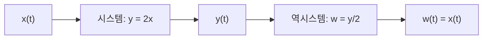



요약

지금의 출력이 지금의 입력만 보고 정해지면 기억 없는 시스템이다. 저항에 걸린 전압처럼, 과거에 무슨 일이 있었는지는 상관없다. 출력을 정하는 데 과거(또는 미래)의 입력이 필요하면 기억이 있는 시스템이다. 축전기는 그동안 들어온 전류를 쌓아 두므로 기억이 있다. 가역성은 출력만 보고 입력을 정확히 되찾을 수 있느냐다. 서로 다른 두 입력이 같은 출력을 내는 순간 되찾을 수 없다.

## 예시로 보기

| 시스템 | 기억 | 가역 | 이유 |
|---|---|---|---|
| $$y(t) = 2x(t)$$ | 없음 | 예 | 역시스템 $$w = \frac12 y$$ (그림 1.45(b))[^1] |
| $$y[n] = \sum_{k=-\infty}^{n}x[k]$$ (누산기) | 있음 | 예 | 역시스템 $$w[n] = y[n] - y[n-1]$$ (그림 1.45(c))[^2] |
| $$y[n] = x[n-1]$$ (지연기) | 있음 | 예 | 한 칸 앞당기면 된다[^s1] |
| $$y[n] = 0$$ | 없음 | 아니오 | 어떤 입력에도 출력이 0[^2] |
| $$y(t) = x^2(t)$$ | 없음 | 아니오 | 출력으로는 입력의 부호를 알 수 없다[^2] |

누산기의 역시스템을 확인해 보자. $$y[n] - y[n-1]$$은 $$n$$까지의 합에서 $$n-1$$까지의 합을 뺀 것이라 마지막 항 $$x[n]$$만 남는다.

## 정의

**기억 없는 시스템.** 독립 변수의 각 값에서 출력이 같은 시각의 입력에만 의존한다[^3]. 예: $$y[n] = (2x[n] - x^2[n])^2$$, 저항 $$y(t) = Rx(t)$$ (입력 전류, 출력 전압), 항등 시스템 $$y(t) = x(t)$$.

**기억 있는 시스템.** 지금 이외의 시각의 입력을 저장해 두고 쓴다[^4]. 예:

- 누산기 $$y[n] = \sum_{k=-\infty}^{n}x[k] = y[n-1] + x[n]$$
- 지연기 $$y[n] = x[n-1]$$
- 축전기 $$y(t) = \dfrac1C\displaystyle\int_{-\infty}^{t}x(\tau)\,d\tau$$ (입력 전류, 출력 전압). 축전기는 전하를 쌓아 에너지를 저장한다.

**가역성.** 서로 다른 입력이 늘 서로 다른 출력을 내면 가역 시스템이다. 그러면 출력 $$y$$를 넣었을 때 원래 입력을 돌려주는 역시스템이 있다[^1].

$$x \to y \text{ 가 가역} \iff y \to w \text{이고 } w = x \text{인 역시스템이 있다}$$

가역 시스템 뒤에 역시스템을 이으면, 둘을 합친 전체는 입력을 그대로 돌려준다. 예시 표 첫 줄의 2배 시스템으로 그렸다(그림 1.45(b)).[^s2]

## 활용

- 가역성은 암호화와 복호화, 손실 없는 압축(zip, PNG)의 조건이다. MP3, JPEG 같은 손실 압축은 일부러 비가역 시스템을 쓴다[^1][^s1].
- 기억 없는 시스템은 언제나 인과적이다 → [인과성](/Hongs_Blog/studies/signals-and-systems/causality/)

## 연결

- 선수: [시스템과 시스템 연결](/Hongs_Blog/studies/signals-and-systems/systems-interconnection/)
- 같은 구조: [역함수](/Hongs_Blog/studies/college-math/inverse-function/) (일대일일 때만 역함수가 있다)

## 확인 문제

**C1** 다음 시스템은 기억이 있는가? ① $$y[n] = x[n]^3$$ ② $$y(t) = x(t - 1)$$ ③ $$y[n] = x[n] + x[n+1]$$

**답:** ① 없음 ② 있음 (1초 전 입력) ③ 있음 (다음 시각 입력; 미래도 "지금 이외"다).

**C2** $$y(t) = x^2(t)$$가 가역이 아님을 보이는 두 입력을 들라.

**답:** $$x_1(t) = 1$$과 $$x_2(t) = -1$$. 둘 다 출력이 1이라 출력만으로 어느 쪽이었는지 알 수 없다.

**C3** $$y[n] = x[n] - x[n-1]$$의 역시스템을 쓰라.

**답:** 누산기 $$w[n] = \sum_{k=-\infty}^{n}y[k]$$. 합이 차례로 상쇄되어 $$x[n]$$이 남는다($$x[-\infty] = 0$$이라고 둘 때).

[^1]: 신호 및 시스템 4회 강의 자료 「Week04_CH01_3_handout」, p.8 (그림 1.45)
[^2]: 같은 자료, p.9
[^3]: 같은 자료, p.6
[^4]: 같은 자료, p.7
[^s1]: 보충 지연기의 가역성, zip·PNG·MP3·JPEG 예, 확인 문제 C3은 원본에 없다.
[^s2]: 보충 다이어그램 1개는 원본에 없다. 정의의 가역성 진술과 4주차 자료 p.8의 그림 1.45(b)를 근거로 그렸다.

