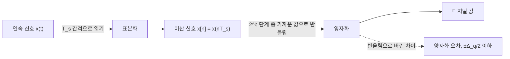



요약

연속 신호를 컴퓨터에 넣으려면 두 번 끊는다. 시간을 일정한 간격으로 끊어 그 순간의 값만 남기는 것이 표본화, 남긴 값을 정해진 몇 단계 중 가장 가까운 것으로 반올림하는 것이 양자화다. 표본을 촘촘히, 단계를 잘게 할수록 원래 신호에 가까워지지만 저장할 데이터가 늘어난다. 양자화에서 버린 값의 차이(양자화 오차)는 되돌릴 수 없다.

## 예시로 보기

흑백 사진을 디지털로 바꾼다고 하자[^1].

1. 표본화: 사진 위에 가로 $$\Delta x$$, 세로 $$\Delta y$$ 간격의 격자를 놓고, 격자점마다 밝기 하나만 읽는다. 격자점 하나가 화소(픽셀) 하나다.
2. 양자화: 읽은 밝기를 $$k$$단계 중 하나로 반올림한다. 8비트를 쓰면 $$2^8 = 256$$단계다.

밝기 단계를 64, 16, 4, 2로 줄이면 사진이 점점 계단처럼 뭉개지다가, 2단계에서는 흑과 백만 남는다(3주차 p.37의 성당 사진)[^2].

## 정의

**표본화.** 연속 신호 $$x(t)$$를 $$T_s$$ 간격으로 읽으면 이산 신호 $$x[n] = x(nT_s)$$가 된다[^3]. 영상에서는 연속 영상 $$f(x, y)$$에 2차원 임펄스 격자를 곱한다[^1].

$$f_s(x, y) = f(x, y)\sum_{j=1}^{M}\sum_{k=1}^{N}\delta(x - j\Delta x,\ y - k\Delta y)$$

[임펄스의 표본화 성질](/Hongs_Blog/studies/signals-and-systems/unit-impulse-step/) 덕분에 곱한 결과에는 격자점의 값만 남는다.

**양자화.** 표본의 크기를 디지털 값으로 바꾸는 단계다[^2].

- 대부분의 장치는 값의 범위를 $$k$$개의 같은 칸으로 나눈다.
- $$b$$비트를 쓰면 단계 수는 $$k = 2^b$$다.
- 사람 눈이 미세한 음영을 느낄 만큼 단계가 많아야 한다. 보통 화소당 8비트, 정밀 측정 장치는 12비트 이상을 쓴다.

칸의 폭을 $$\Delta_q$$라 하고 각 칸의 가운데 값으로 반올림하면, 양자화 오차는 $$\pm\Delta_q/2$$를 넘지 않는다[^s1]. 범위 $$-1 \sim 1$$을 4비트로 나누면 $$\Delta_q = 2/16 = 0.125$$이고 최대 오차는 0.0625다.

표본화는 시간을 끊고, 양자화는 값을 끊는다. 양자화에서 반올림으로 버린 차이는 점선 가지로 떨어져 나가고 되돌릴 수 없다.[^s3]

## 예제

**정현파 표본화.**[^s1] 2Hz 코사인 $$\cos(2\pi \cdot 2t)$$를 $$T_s = 0.05$$초(초당 20번)로 읽으면 $$x[n] = \cos(2\pi \cdot 0.1\,n)$$이다. $$\frac{\omega_0}{2\pi} = 0.1 = \frac{1}{10}$$이므로 10개마다 되풀이된다. 연속 신호의 한 주기(0.5초) 동안 정확히 10개를 뽑기 때문이다.

동그라미가 $$T_s = 0.05$$초마다 뽑은 표본이고, 네모가 그 값을 3비트 8단계(점선) 중 가운데 값으로 반올림한 것이다. 아래의 오차는 칸 폭의 절반인 $$\pm 0.125$$를 넘지 않는다[^s2].

검증: $$x[n] = x(nT_s)$$와 10개 주기, $$b$$비트 양자화의 단계 수 $$2^b$$, 최대 오차 $$\Delta_q/2$$를 계산해 확인 — [11_sampling-quantization_verify.py](/Hongs_Blog/studies/signals-and-systems/code/11_sampling-quantization_verify/)

## 활용

- 음악 CD는 초당 44,100번 표본화하고 16비트로 양자화한다[^s1].
- 표본 간격이 너무 넓으면 빠른 신호가 느린 신호로 잘못 보인다. 12주차 자료는 주파수 $$f$$인 정현파를 서로 다른 표본화율 $$f_s$$로 뽑은 그림으로 이를 보인다[^4]. 정확한 조건(표본화 정리)은 4장 뒤에서 다룬다.
- 그림 (A)~(D)처럼 표본화율과 양자화 단계를 함께 늘려야 원래 곡선에 가까워진다[^2].

표본 간격이 너무 넓은 예다. 2Hz 코사인을 초당 2.5번만 뽑으면, 그 점들이 0.5Hz 코사인 위에 그대로 놓여 느린 신호로 보인다[^s2].

## 연결

- 선수: [연속 시간 신호와 이산 시간 신호](/Hongs_Blog/studies/signals-and-systems/ct-dt-signals/), [단위 임펄스와 단위 계단](/Hongs_Blog/studies/signals-and-systems/unit-impulse-step/)
- 관련: [이산 시간 복소 지수 신호](/Hongs_Blog/studies/signals-and-systems/dt-complex-exponential/) (표본화한 정현파의 주기)

## 확인 문제

**C1** 다음은 표본화와 양자화 중 무엇을 바꾸는가? ① 사진의 해상도를 1000×1000에서 500×500으로 ② 화소당 비트를 8에서 4로 ③ 녹음을 초당 48,000번에서 8,000번으로

**답:** ① 표본화(격자 간격) ② 양자화(단계 수 256 → 16) ③ 표본화(시간 간격).

**C2** 밝기를 16단계로 나타내려면 몇 비트가 필요한가? 6비트면 몇 단계인가?

**답:** $$2^4 = 16$$이므로 4비트. 6비트면 $$2^6 = 64$$단계.

[^1]: 3-1학기/신호 및 시스템/1.수업자료/03.Week03_CH01_2_handout.pdf, p.35
[^2]: 같은 자료, p.36~37
[^3]: 3-1학기/신호 및 시스템/1.수업자료/02.Week02_CH01_1_handout.pdf, p.4, p.13
[^4]: 3-1학기/신호 및 시스템/1.수업자료/12.Week12_CH03_4_handout.pdf, p.3
[^s1]: 에이전트 보충. 양자화 오차의 한계 $$\Delta_q/2$$와 4비트 예, 2Hz 코사인 표본화 예, 음악 CD의 수치, 확인 문제는 원본에 없다. 계산은 검증 코드로 확인했다.
[^s2]: 에이전트 보충. 그림 2장은 원본에 없다. [11_sampling-quantization_plot.py](/Hongs_Blog/studies/signals-and-systems/code/11_sampling-quantization_plot/)로 그렸고, 같은 코드로 다음을 확인했다: 10개마다 되풀이, 3비트 양자화의 8단계와 최대 오차 0.125, 2Hz와 0.5Hz 코사인이 초당 2.5번 뽑은 표본에서 같음. 3비트와 2.5Hz 표본화는 설명을 위해 고른 값이다.
[^s3]: 에이전트 보충. 다이어그램 1개는 원본에 없다. 정의의 표본화·양자화 절(2주차 자료 p.4, 3주차 자료 p.35~37)을 근거로 그렸다.

