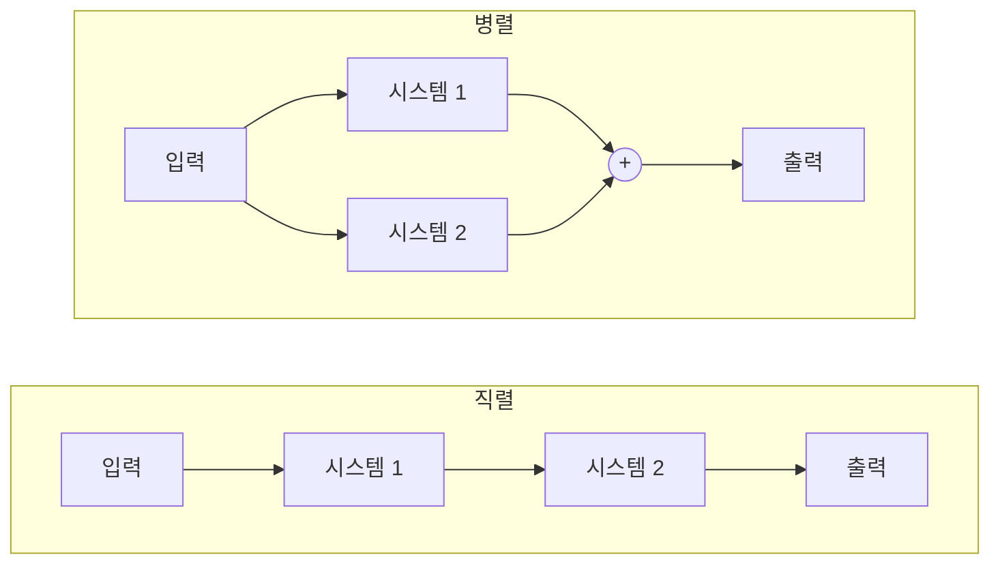
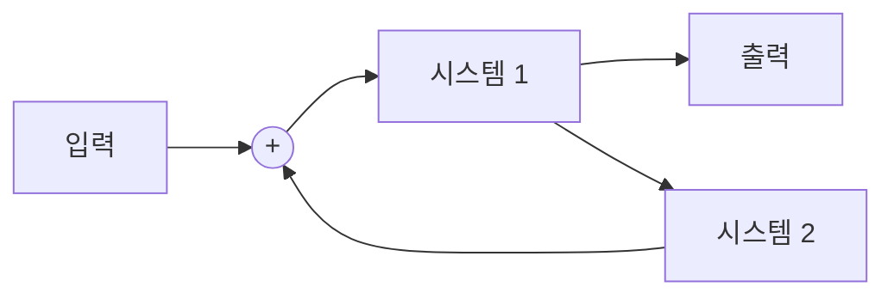



요약

시스템은 입력 신호를 받아 출력 신호로 바꾸는 상자다. 녹음기(소리 → 전기), 회로(전원 전압 → 축전기 전압), 자동차(엔진 힘 → 속도)가 모두 시스템이다. 복잡한 시스템은 작은 상자들을 줄줄이(직렬), 나란히(병렬), 되먹임(피드백)으로 이어 만든다. 상자 안을 몰라도 입력과 출력의 관계만으로 성질을 따질 수 있다는 것이 이 관점의 힘이다. 다만 같은 상자라도 언제 어떤 입력을 넣느냐에 따라 출력이 다를 수 있어, 그 규칙을 식으로 정확히 적어야 한다.

## 예시로 보기

서로 전혀 다른 세 대상이 같은 꼴의 식이 된다[^1].

| 예 | 입력 | 출력 | 식 |
|---|---|---|---|
| RC 회로 (예제 1.8) | 전원 전압 $$v_s(t)$$ | 축전기 전압 $$v_c(t)$$ | $$\dfrac{dv_c}{dt} + \dfrac{1}{RC}v_c = \dfrac{1}{RC}v_s$$ |
| 자동차 (예제 1.9) | 엔진의 힘 $$f(t)$$ | 속도 $$v(t)$$ | $$\dfrac{dv}{dt} + \dfrac{\rho}{m}v = \dfrac1m f$$ |
| 은행 계좌 (예제 1.10) | $$n$$번째 달 순입금액 $$x[n]$$ | $$n$$번째 달 말 잔액 $$y[n]$$ | $$y[n] = 1.01y[n-1] + x[n]$$ |

자동차 식은 뉴턴 법칙 $$f - \rho v = m\dfrac{dv}{dt}$$에서 나온다. $$\rho v$$는 속도에 비례하는 마찰이다. 앞의 둘은 모두 $$\dfrac{dy}{dt} + ay = bx$$ 꼴의 1계 선형 미분방정식이다. 은행 계좌는 이자율 1%를 붙여 한 달씩 넘어가는 이산 시간 시스템이고, $$y[n] - 1.01y[n-1] = x[n]$$으로 쓰면 1계 차분방정식이다.

## 정의

연속 시간 시스템은 연속 시간 입력을 연속 시간 출력으로 바꾸고 $$x(t) \to y(t)$$로 적는다. 이산 시간 시스템은 $$x[n] \to y[n]$$이다(그림 1.41)[^2]. 연속 입력을 A/D 변환기로 표본화한 뒤 이산 시스템으로 처리하는 것은 혼합 시스템이다.

**연결 방식**[^3]

| 연결 | 모양 | 예 |
|---|---|---|
| 직렬(cascade) | 시스템 1의 출력이 시스템 2의 입력 | 전파 → 라디오 수신 → 증폭 |
| 병렬 | 같은 입력이 두 시스템에 들어가고 출력을 더함 | 마이크 여러 개를 한 증폭기에 연결 |
| 직렬-병렬 | 위 둘을 섞음 (그림 1.42(c)) | |
| 피드백 | 시스템 1의 출력이 시스템 2를 거쳐 다시 시스템 1의 입력에 더해짐 | 비행기 자동조종 장치 |

직렬에서는 신호가 상자를 차례로 한 번씩 지나고, 병렬에서는 같은 입력이 두 갈래로 나뉘었다가 더해진다. 아래 피드백 그림에서는 시스템 1의 출력이 시스템 2를 거쳐 입력 쪽으로 되돌아간다.[^s2]

## 활용

- 블록 그림은 회로도, 신호 처리 프로그램(Simulink 등), 제어 시스템 설계의 공통 언어다. 2주차 자료는 RC 회로를 Simulink의 계단 입력 → 상태공간 블록 → 스코프로 그려 충전 곡선을 보인다[^4].
- 피드백은 출력을 보고 입력을 고치는 구조라 자동조종, 온도 조절, 음성 증폭의 하울링(나쁜 피드백)까지 설명한다[^s1].
- 이후 13~17번 문서는 이 상자가 가진 성질(기억, 가역성, 인과성, 안정성, 시불변성, 선형성)을 하나씩 정의한다.

## 연결

- 선수: [1계 선형 미분방정식](/Hongs_Blog/studies/signals-and-systems/first-order-linear-ode/) (예의 식)
- 다음: [기억과 가역성](/Hongs_Blog/studies/signals-and-systems/memory-invertibility/), [인과성](/Hongs_Blog/studies/signals-and-systems/causality/), [안정성](/Hongs_Blog/studies/signals-and-systems/stability/), [시불변성](/Hongs_Blog/studies/signals-and-systems/time-invariance/), [선형성](/Hongs_Blog/studies/signals-and-systems/linearity/)

## 확인 문제

**C1** 은행 계좌 예에서 이자율이 월 2%이고 매달 100씩 입금한다. 식으로 쓰고, $$y[-1] = 0$$일 때 $$y[1]$$을 구하라.

**답:** $$y[n] = 1.02y[n-1] + 100$$. $$y[0] = 100$$, $$y[1] = 1.02 \times 100 + 100 = 202$$.

**C2** RC 회로와 자동차는 물리적으로 전혀 다른데, 왜 같은 꼴의 식이 되는가?

**답:** 둘 다 "변화율 = (입력에 비례하는 양) − (지금 값에 비례해 깎이는 양)" 구조다. RC 회로는 저항을 지나는 전류가 전압 차에 비례하고, 자동차는 마찰이 속도에 비례한다. 그래서 둘 다 $$\dfrac{dy}{dt} + ay = bx$$가 된다.

[^1]: 3-1학기/신호 및 시스템/1.수업자료/04.Week04_CH01_3_handout.pdf, p.3~4 (예제 1.8~1.10)
[^2]: 같은 자료, p.2 (그림 1.41)
[^3]: 같은 자료, p.5 (그림 1.42)
[^4]: 3-1학기/신호 및 시스템/1.수업자료/02.Week02_CH01_1_handout.pdf, p.14
[^s1]: 에이전트 보충. 온도 조절·하울링 예, 확인 문제는 원본에 없다.
[^s2]: 에이전트 보충. 다이어그램 1개(직렬·병렬)는 원본에 없다. 정의의 연결 방식 표와 4주차 자료 p.5의 그림 1.42를 근거로 그렸다.

